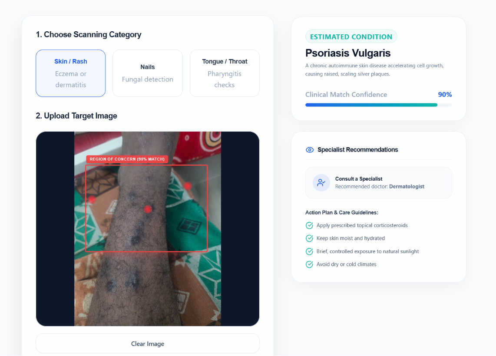

# MedAssist AI

> An educational clinical decision-support prototype built with React and FastAPI. It demonstrates authenticated symptom logging, explainable rule-based pattern matching, PDF report generation, and a clearly simulated image-scanner workflow.



## What this repository demonstrates

- A React + TypeScript single-page application with registration, sign-in, a dashboard, assessment history, settings, and educational health content.
- A FastAPI REST API with JWT-protected routes, password hashing, SQLAlchemy models, and local SQLite persistence.
- A symptom assessment engine that scores overlap against a small, explicit condition/symptom knowledge base, reports matched and missing indicators, and surfaces a limited set of emergency flags.
- PDF export of saved assessment records.
- A prototype image-scanner interface for skin, nail, and tongue categories.
- A pattern-based chat endpoint for a fixed set of health-information responses.

## Important scope and limitations

**This is not a medical device, diagnostic system, or emergency service.** It must not be used for diagnosis, treatment decisions, or real clinical triage. Seek qualified medical help or local emergency services for urgent symptoms.

The project intentionally does **not** claim trained clinical AI:

- `prediction_engine.py` is a deterministic knowledge-base matcher. Its displayed “confidence” is a normalized match score, not a clinical probability or model calibration.
- `cnn_scanner.py` does not load, train, or run a CNN. It selects predefined sample output deterministically from the scan category and uploaded byte length, so it does not inspect image content.
- `chat_agent.py` matches text against fixed regular-expression patterns; it is not an LLM or clinical conversational model.
- Local development uses SQLite and browser `localStorage` for the access token. Do not enter real personal health information. A production deployment would need a threat model, encrypted transport and storage, secure token handling, appropriate access control, audit logging, clinical review, and regulatory assessment.

## Architecture

```text
React + TypeScript (Vite)
  ├─ public pages: landing, login, registration
  └─ authenticated dashboard
       ├─ symptom assessment / reports
       ├─ simulated image scanner
       └─ pattern-based health chat
                 │ HTTP + Bearer token
                 ▼
FastAPI (`/api/v1`)
  ├─ auth: bcrypt password hashing + JWT issuance
  ├─ assessment: rule-based symptom matcher + PDF export
  ├─ scanner: deterministic, predefined prototype responses
  └─ chat: regular-expression response matching
                 │
                 ▼
SQLite via SQLAlchemy (local development)
```

## Repository layout

```text
frontend/              React, TypeScript, Vite, Tailwind UI
backend/app/
  api/                 Authentication, assessment, scanner, and chat endpoints
  auth/                Password hashing and JWT helpers
  database/            SQLAlchemy connection and models
  ml/                  Rule-based assessment, simulated scanner, pattern chat
  services/            PDF report generation
demo/                  Screenshot asset used in this README
```

## Local setup

### Prerequisites

- Node.js 20+
- Python 3.10+

### Backend

```bash
cd backend
python -m venv .venv
# Windows PowerShell
.\.venv\Scripts\Activate.ps1
# macOS/Linux
# source .venv/bin/activate
pip install -r requirements.txt
copy .env.example .env        # Windows
# cp .env.example .env        # macOS/Linux
```

Replace `SECRET_KEY` in `backend/.env` with a long, random value. Then start the API:

```bash
uvicorn app.main:app --reload --port 8000
```

The API docs are available at [http://localhost:8000/docs](http://localhost:8000/docs), and the OpenAPI document is at `/api/v1/openapi.json`.

### Frontend

In a separate terminal:

```bash
cd frontend
npm ci
npm run dev
```

Open [http://localhost:5173](http://localhost:5173). The current frontend targets the local API at `http://localhost:8000`.

## API overview

All routes below are prefixed with `/api/v1`. Routes other than registration and login require `Authorization: Bearer <token>`.

| Area | Endpoint | Purpose |
| --- | --- | --- |
| Health | `GET /health` | Basic API health response |
| Auth | `POST /auth/register` | Create a user and return a JWT |
| Auth | `POST /auth/login` | Authenticate and return a JWT |
| Auth | `GET /auth/me`, `PUT /auth/profile` | Read or update the current profile |
| Assessment | `GET /assessment/symptoms` | List knowledge-base symptom labels |
| Assessment | `POST /assessment/submit` | Store an assessment and return rule-based guidance |
| Assessment | `GET /assessment/history` | List the current user’s assessments |
| Assessment | `GET /assessment/report/{prediction_id}/download` | Download a saved report as PDF |
| Prototype scanner | `POST /scanner/upload` | Return predefined simulated scanner output; requires `Scan-Type` header |
| Chat | `POST /chat/message` | Return a pattern-matched educational response |

## Security and data-handling notes

- The repository contains no tracked `.env`, database, private-key, or build-output files.
- The application now requires `SECRET_KEY` through the environment; use `backend/.env.example` only as a template.
- Passwords are hashed with bcrypt. This is not a complete production security posture.
- The generated local SQLite database (`medassist_ai.db`) is ignored by Git. Treat it as sensitive if it contains user data.

## Validation

Run the frontend checks with:

```bash
cd frontend
npm run lint
npm run build
```

The backend currently has no automated test suite. `backend/scratch/verify_advanced.py` is a manual smoke script that expects a running server and an existing test account; it is not part of a repeatable test harness.

## License

No license has been supplied in this repository. All rights are reserved unless the owner adds a license.
